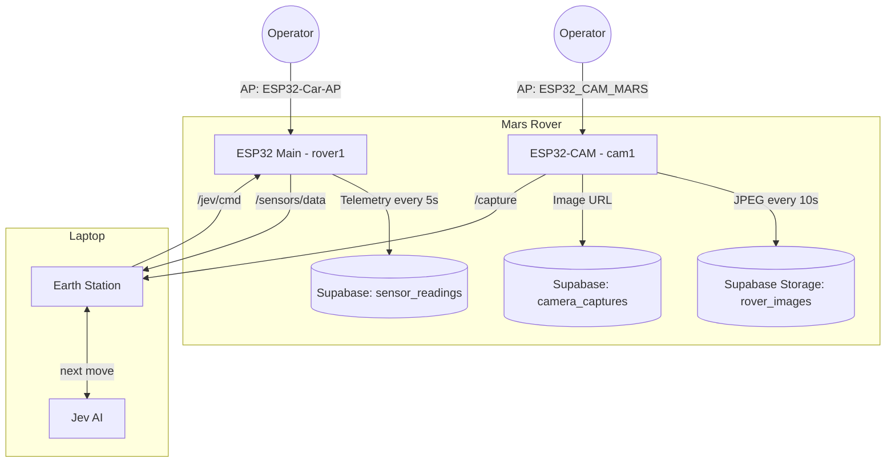

# 🚀 Mars Rover


**Chief Scientist: Hammad**

A two-board Mars rover. The main ESP32 drives the rover, avoids obstacles and logs sensor telemetry to Supabase. A separate ESP32-CAM captures images and uploads them to Supabase Storage. Each board also hosts its own WiFi access point with a local control/viewing page.

The **Earth Station** is a Python program on a laptop that lets the **Jev** AI drive the rover (*Jev Auto* mode), using the rover's telemetry and a description of what the camera sees.

📋 **The plan:** [SPEC.md](SPEC.md) has the requirements, the target setup (one phone hotspot, boards found automatically, a mission control page) and the milestones in build order.

---

## 🏗 System Architecture



## ✅ Current Status

| Component | Status |
|---|---|
| Rover firmware (`rover1/`) | ✅ Working |
| Camera firmware (`cam1/`) | ✅ Working |
| Supabase database + storage | ✅ Working |
| AP mode — rover control page | ✅ Working |
| AP mode — camera live view | ✅ Working |
| Earth Station (`earth_station/`) | 🧪 Runs on the simulator |
| Rover Jev Auto mode (firmware 2.1) | 🧪 Written and compiles; waiting for a test on the real rover |
| Real Jev connection | ✅ Ready: add your key to `.env` (see Quick Start part C) |
| Photo descriptions (`describe.py`) | ⏳ Planned ([SPEC.md](SPEC.md) milestone 5) |
| Easy setup: one `.env` for both boards, `--check` | ✅ Works ([SPEC.md](SPEC.md) milestone 1) |
| Board finder: no IP addresses to type | ✅ Works on the simulator ([SPEC.md](SPEC.md) milestone 2) |
| Camera name `cam.local` and `/id` (firmware 2.1) | 🧪 Written, compiles in CI; waiting for the hardware test ([SPEC.md](SPEC.md) milestone 4) |
| Mission control page | ⏳ Planned ([SPEC.md](SPEC.md) milestone 6) |

---

## 🛠 Features

### 🤖 Rover (`rover1/rover1.ino`)
*   **Autonomous Navigation**: Obstacle avoidance with an HC-SR04 ultrasonic sensor (median-of-3 filtering, back up and turn when closer than 40 cm).
*   **Manual Mode**: Forward/stop toggle from the control page.
*   **Jev Auto Mode**: a third button on the control page hands driving to the Earth Station laptop. The rover takes short moves (up to 0.5 s) over `POST /jev/cmd` with a shared token. It refuses to drive forward under 20 cm or while tilted, and stops by itself if the laptop goes quiet for 1.5 s.
*   **Found by name**: announces itself as `rover.local` on the WiFi network, and answers `/id`.
*   **IMU Telemetry (MPU6050)**: Pitch, roll and terrain vibration via the `MPU6050_tockn` library, with gyro calibration on boot.
*   **Environmental Sensing**: Temperature and humidity (DHT11), pressure and relative altitude (BMP280), day/night (LDR).
*   **Event Log**: `last_event` field records `Obstacle Avoided`, `Tilt Warning`, `Impact Detected` or `Nominal`.
*   **Dual-Mode WiFi**:
    *   **AP Mode** (`ESP32-Car-AP`): Local control page at `http://192.168.4.1` with live telemetry.
    *   **Station Mode**: Posts readings to Supabase `sensor_readings` every 5 seconds.

### 👁 Camera (`cam1/cam1.ino`)
*   **ESP32-CAM (AI Thinker)**: VGA JPEG capture (falls back to CIF if PSRAM is not available).
*   **AP Mode** (`ESP32_CAM_MARS`): Live view page at `http://192.168.4.1`, refreshing every 3 seconds.
*   **Findable on the hotspot** (firmware 2.1): announces `cam.local` and answers `GET /id` with `{"board": "camera"}`, so the Earth Station finds it without an IP address. At boot it prints whether it joined the hotspot, its IP address and its name.
*   **Cloud Uplink**: Uploads a JPEG to the `rover_images` bucket every 10 seconds and saves its public URL in `camera_captures`.

### 🛰 Earth Station (`earth_station/`)
*   **Jev Auto**: twice a second, reads telemetry, reads the latest camera description, asks Jev for the next move and sends it to the rover.
*   **Two safety layers**: laptop-side gate (confidence, stale data, blocked path) plus the rover's own reflexes and watchdog.
*   **Runs anywhere**: built-in simulator and mock Jev, so it works on any laptop with no hardware or keys.
*   **Real Jev**: set `JEV_MODE=live` and your key in `.env` to let TypeSafe's Jev make the decisions, even against the simulator.
*   **Run logs**: every decision saved to `runs/*.jsonl` for replay.
*   **One place for the hotspot**: type the hotspot name and password once in `.env`; `python -m earth_station.secrets` writes both boards' `secrets.h` from it and makes the rover token.
*   **Check command**: `python -m earth_station --check` tests the settings files, the rover, the camera and Jev, and says in plain words how to fix each problem. Nothing moves.
*   **Finds the boards by itself**: looks for `rover.local` / `cam.local` with its own mDNS lookup (so it works the same on Windows, Mac and Linux), then scans the hotspot asking each address `GET /id`. `ROVER_URL` / `CAMERA_URL` in `.env` are only needed as an override.

Full guide: [docs/EARTH_STATION.md](docs/EARTH_STATION.md). Design walkthrough: open [docs/design/earth-station-plan.html](docs/design/earth-station-plan.html) in a browser.

---

## 📂 Project Structure

```text
mars-rover/
├── rover1/
│   ├── rover1.ino            # 🤖 Main rover firmware (ESP32)
│   └── secrets.example.h     # Credential template -> copy to secrets.h
├── cam1/
│   ├── cam1.ino              # 👁 Camera firmware (ESP32-CAM)
│   └── secrets.example.h     # Credential template -> copy to secrets.h
├── earth_station/            # 🛰 Laptop ground station (Python) + rover simulator
│   ├── secrets.py            # Writes both boards' secrets.h from .env, makes the rover token
│   ├── finder.py             # Finds the rover and camera: .env, simulator, .local name, network scan
│   ├── mdns.py               # Looks up rover.local / cam.local itself (mDNS)
│   └── check.py              # `--check`: tests every piece, says how to fix it
├── tests/                    # Earth Station tests (pytest)
├── scripts/                  # One-command setup: setup.ps1 (Windows), setup.sh (Mac/Linux)
├── docs/
│   ├── ARCHITECTURE.md       # Design, data model, pin map, security model
│   ├── EARTH_STATION.md      # Earth Station guide + rover protocol
│   ├── design/               # Design pages (open in a browser)
│   └── supabase/schema.sql   # Tables + row-level security policies
├── .github/                  # CI (compile + secret scan), PR/issue templates
├── pyproject.toml            # Earth Station package + tools
├── .env.example              # Credentials / endpoints / Earth Station settings
├── SPEC.md                   # The plan: requirements, target setup, milestones
├── CLAUDE.md                 # Guide for Claude Code / contributors
├── PROGRESS.md               # Project diary: what we did, decided, and what's next
├── CONTRIBUTING.md
├── SECURITY.md
└── CHANGELOG.md
```

---

## 🚀 Quick Start

### A. Just the laptop (no rover needed)

1. Install **Python 3.11 or newer** from [python.org](https://www.python.org/downloads/). On Windows, tick **"Add Python to PATH"** in the installer.
2. Install **git** from [git-scm.com](https://git-scm.com/downloads).
3. Open a terminal (Windows: PowerShell) and get the project:
   ```sh
   git clone https://github.com/Hammad-Sheikhh/mars-rover.git
   cd mars-rover
   ```
4. Run the one-time setup. It creates a private Python install in `.venv/`, installs everything, and creates your `.env` settings file:
   ```sh
   powershell -ExecutionPolicy Bypass -File scripts\setup.ps1   # Windows
   sh scripts/setup.sh                                          # macOS / Linux
   ```
   It should end with **"Setup done"**.
5. Turn on the private Python install (do this each time you open a new terminal):
   ```sh
   .\.venv\Scripts\Activate.ps1    # Windows
   . .venv/bin/activate            # macOS / Linux
   ```
   Your prompt now starts with `(.venv)`.
6. Try it with the built-in fake rover:
   ```sh
   python -m earth_station --sim
   ```
   You should see a pre-flight list of `OK` lines, then one line per decision, like `#7 turn_right 0.91 -> sent, rover ok`. Press `Ctrl+C` to stop.
7. Try the check command on the fake rover: `python -m earth_station --check --sim`. It should end with **"All 5 checks OK"**.

### B. With the real rover and camera

Do this once per phone hotspot. You need the boards plugged into your computer with a USB cable, and the **Arduino IDE 2.x** with the **ESP32 board package 3.x** (Tools → Board → Boards Manager → search "esp32" by Espressif).

1. On your phone, turn on the **hotspot**. If it asks, pick the **2.4 GHz** band: ESP32 boards can't see 5 GHz WiFi.
2. Open `.env` in the project folder (setup created it) and fill in:
   ```sh
   WIFI_SSID=<your hotspot name>
   WIFI_PASS=<your hotspot password>
   ROVER_AP_PASS=<8+ characters, for the rover's own control page>
   CAM_AP_PASS=<8+ characters, for the camera's own page>
   ```
   Save it. `.env` never goes to GitHub.
3. Write both boards' settings files:
   ```sh
   python -m earth_station.secrets
   ```
   It should print `OK` for the rover token, `rover1/secrets.h` and `cam1/secrets.h`. It also makes a long random **rover token** (the password the laptop uses to drive the rover) and saves it in `.env`. Running it again is safe: it keeps the token, and saves any old `secrets.h` as `secrets.h.bak`.
4. **Flash** (upload the program to) each board from the Arduino IDE:
   * **Rover**: open `rover1/rover1.ino`, choose board **ESP32 Dev Module**, then click **Upload** (→). Libraries it needs (Tools → Manage Libraries): `Adafruit BMP280 Library`, `Adafruit Unified Sensor`, `DHT sensor library`, `MPU6050_tockn`.
   * **Camera**: open `cam1/cam1.ino`, choose board **AI Thinker ESP32-CAM** with PSRAM enabled, then **Upload**.

   Keep the rover still while it powers on: the gyro calibrates at boot.
5. Open the **Serial monitor** (the magnifier icon, top right; set it to **115200 baud**). It shows the messages a board prints. Each board should say it joined the hotspot and print its IP address and its name (`rover.local`, `cam.local`). Write the addresses down, just in case.
6. Leave `ROVER_URL` and `CAMERA_URL` in `.env` empty: the Earth Station finds the boards by itself (by their names `rover.local` / `cam.local`, or by scanning the hotspot). If step 7 says a board wasn't found, put the IP address from step 5 in `.env`, e.g. `CAMERA_URL=http://<camera IP address>`.
7. Connect the laptop to the same hotspot, then run:
   ```sh
   python -m earth_station --check
   ```
   It first finds the boards: you should see `rover found at http://<address> (rover.local)` or `(network scan)`. Every line should say `OK`. A line with `X` says what's wrong, where it looked and how to fix it.
8. Drive: `python -m earth_station --suggest` first (Jev only suggests, the rover never moves), then press **Jev Auto** on the rover's control page. More in [docs/EARTH_STATION.md](docs/EARTH_STATION.md#run-it-with-the-real-rover).

If someone else flashes the rover, send them `rover1/secrets.h` (or just the token) **privately**, never on GitHub. The token in their `rover1/secrets.h` must equal `ROVER_CMD_TOKEN` in your `.env`; `--check` tells you if they differ.

### C. Connect the real Jev (no rover needed)

1. Get a key: sign in at [console.typesafe.ai/keys](https://console.typesafe.ai/keys) and create an API key. Copy it.
2. Open `.env` in the repo folder and set:
   ```sh
   JEV_MODE=live
   JEV_API_KEY=<paste your key here>
   ```
   Save the file. `.env` never goes to GitHub, so the key stays private. Never paste it into code, issues or chat.
3. Test it with the fake rover (internet needed, no rover):
   ```sh
   python -m earth_station --sim
   ```
   The pre-flight should show `OK  Jev live` and `OK  Jev answering | <time> ms`. Each decision line is now the real Jev's choice.
4. If it fails, the pre-flight line says why: `rejected the API key` means the key is wrong, and `rate-limited` means wait a moment and try again. To go back to the offline stand-in, set `JEV_MODE=mock`.

### D. Supabase (optional, will be removed later)
The boards also upload readings and photos to Supabase. To use it, put `SUPABASE_URL` and `SUPABASE_ANON_KEY` in `.env` (the **anon** key only, never `service_role`), then run [`docs/supabase/schema.sql`](docs/supabase/schema.sql) in the Supabase SQL editor. It creates:
*   **`sensor_readings`**: `temperature`, `humidity`, `ldr_state`, `pressure`, `altitude`, `pitch`, `roll`, `vibration`, `last_event`
*   **`camera_captures`**: `image_url`
*   **Storage bucket `rover_images`** (public)
*   **Row-level security**: the device (anon) key can only insert, never update or delete.

---

## 🤝 Contributing & Security

*   Workflow, branch naming and commit style: [CONTRIBUTING.md](CONTRIBUTING.md)
*   The plan and build order: [SPEC.md](SPEC.md)
*   What we've done so far and what's next: [PROGRESS.md](PROGRESS.md)
*   System design and known gaps: [docs/ARCHITECTURE.md](docs/ARCHITECTURE.md)
*   Reporting vulnerabilities: [SECURITY.md](SECURITY.md). Please don't open public issues for these.

---

## 📌 Pin Map (Rover)

| Function | Pins |
|---|---|
| Motor driver | ENA 23, IN1 22, IN2 21, ENB 19, IN3 18, IN4 5 |
| Ultrasonic | TRIG 32, ECHO 35 |
| DHT11 | 27 |
| LDR | 33 (LED indicator 4) |
| I2C (MPU6050, BMP280) | SDA 25, SCL 26 |

---

## 🔧 Technology Stack

*   **Hardware**: ESP32, ESP32-CAM, MPU6050, BMP280, DHT11, HC-SR04, LDR module, L298N-style motor driver.
*   **Firmware**: C++ (Arduino framework).
*   **Backend**: Supabase (PostgreSQL + Storage).
*   **Earth Station**: Python 3.11+, `httpx`, Jev (Typesafe AI); `pytest` + `ruff`.

---

## 📜 License
MIT License.
