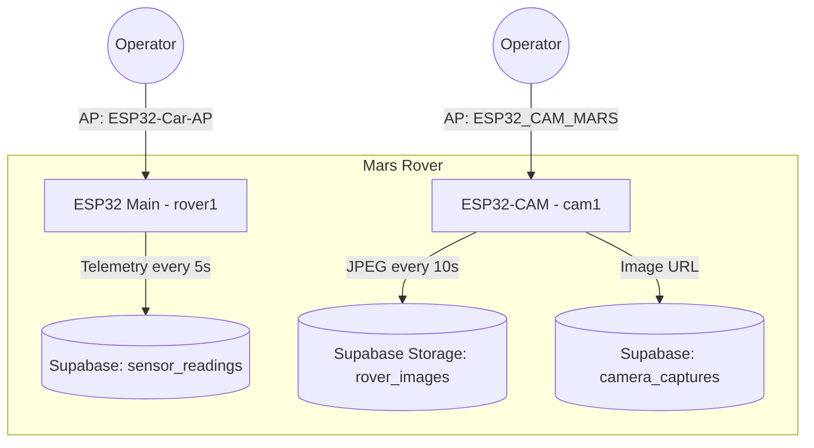

# 🚀 Mars Rover


**Chief Scientist: Hammad**

A two-board Mars rover. The main ESP32 drives the rover, avoids obstacles and logs sensor telemetry to Supabase. A separate ESP32-CAM captures images and uploads them to Supabase Storage. Each board also hosts its own WiFi access point with a local control/viewing page.

---

## 🏗 System Architecture



## ✅ Current Status

| Component | Status |
|---|---|
| Rover firmware (`rover1/`) | ✅ Working |
| Camera firmware (`cam1/`) | ✅ Working |
| Supabase database + storage | ✅ Working |
| AP mode — rover control page | ✅ Working |
| AP mode — camera live view | ✅ Working |

---

## 🛠 Features

### 🤖 Rover (`rover1/rover1.ino`)
*   **Autonomous Navigation**: Obstacle avoidance with an HC-SR04 ultrasonic sensor (median-of-3 filtering, back up and turn when closer than 40 cm).
*   **Manual Mode**: Forward/stop toggle from the control page.
*   **IMU Telemetry (MPU6050)**: Pitch, roll and terrain vibration via the `MPU6050_tockn` library, with gyro calibration on boot.
*   **Environmental Sensing**: Temperature and humidity (DHT11), pressure and relative altitude (BMP280), day/night (LDR).
*   **Event Log**: `last_event` field records `Obstacle Avoided`, `Tilt Warning`, `Impact Detected` or `Nominal`.
*   **Dual-Mode WiFi**:
    *   **AP Mode** (`ESP32-Car-AP`): Local control page at `http://192.168.4.1` with live telemetry.
    *   **Station Mode**: Posts readings to Supabase `sensor_readings` every 5 seconds.

### 👁 Camera (`cam1/cam1.ino`)
*   **ESP32-CAM (AI Thinker)**: VGA JPEG capture (falls back to CIF if PSRAM is not available).
*   **AP Mode** (`ESP32_CAM_MARS`): Live view page at `http://192.168.4.1`, refreshing every 3 seconds.
*   **Cloud Uplink**: Uploads a JPEG to the `rover_images` bucket every 10 seconds and saves its public URL in `camera_captures`.

---

## 📂 Project Structure

```text
mars-rover/
├── rover1/
│   ├── rover1.ino            # 🤖 Main rover firmware (ESP32)
│   └── secrets.example.h     # Credential template -> copy to secrets.h
├── cam1/
│   ├── cam1.ino              # 👁 Camera firmware (ESP32-CAM)
│   └── secrets.example.h     # Credential template -> copy to secrets.h
├── docs/
│   ├── ARCHITECTURE.md       # Design, data model, pin map, security model
│   └── supabase/schema.sql   # Tables + row-level security policies
├── .github/                  # CI (compile + secret scan), PR/issue templates
├── .env.example              # Reference list of credentials / endpoints
├── CLAUDE.md                 # Guide for Claude Code / contributors
├── CONTRIBUTING.md
├── SECURITY.md
└── CHANGELOG.md
```

---

## 🚀 Quick Start

### 1. Supabase Setup
Run [`docs/supabase/schema.sql`](docs/supabase/schema.sql) in the Supabase SQL editor. It creates:
*   **`sensor_readings`**: `temperature`, `humidity`, `ldr_state`, `pressure`, `altitude`, `pitch`, `roll`, `vibration`, `last_event`
*   **`camera_captures`**: `image_url`
*   **Storage bucket `rover_images`** (public)
*   **Row-level security**: the device (anon) key can only insert, never update or delete.

### 2. Credentials
Credentials never go in git. Each sketch reads them from a local, git-ignored `secrets.h`:

```sh
cp rover1/secrets.example.h rover1/secrets.h
cp cam1/secrets.example.h  cam1/secrets.h
```

Fill in the WiFi network, AP password and Supabase URL + **anon** key. Never use the `service_role` key on a device.

### 3. Firmware Deployment
Requires **ESP32 Arduino core 3.x** (uses the pin-based `ledcAttach` API).

*   **Rover**: Open `rover1/rover1.ino` and upload with board **ESP32 Dev Module**.
    *   Libraries: `Adafruit BMP280`, `Adafruit Unified Sensor`, `DHT sensor library`, `MPU6050_tockn`.
    *   I2C: SDA 25, SCL 26.
*   **Camera**: Open `cam1/cam1.ino` and upload with board **AI Thinker ESP32-CAM** (PSRAM enabled).

Keep the rover still while it powers on, because the gyro calibrates at boot.

---

## 🤝 Contributing & Security

*   Workflow, branch naming and commit style: [CONTRIBUTING.md](CONTRIBUTING.md)
*   System design and known gaps: [docs/ARCHITECTURE.md](docs/ARCHITECTURE.md)
*   Reporting vulnerabilities: [SECURITY.md](SECURITY.md). Please don't open public issues for these.

---

## 📌 Pin Map (Rover)

| Function | Pins |
|---|---|
| Motor driver | ENA 23, IN1 22, IN2 21, ENB 19, IN3 18, IN4 5 |
| Ultrasonic | TRIG 32, ECHO 35 |
| DHT11 | 27 |
| LDR | 33 (LED indicator 4) |
| I2C (MPU6050, BMP280) | SDA 25, SCL 26 |

---

## 🔧 Technology Stack

*   **Hardware**: ESP32, ESP32-CAM, MPU6050, BMP280, DHT11, HC-SR04, LDR module, L298N-style motor driver.
*   **Firmware**: C++ (Arduino framework).
*   **Backend**: Supabase (PostgreSQL + Storage).

---

## 📜 License
MIT License.
