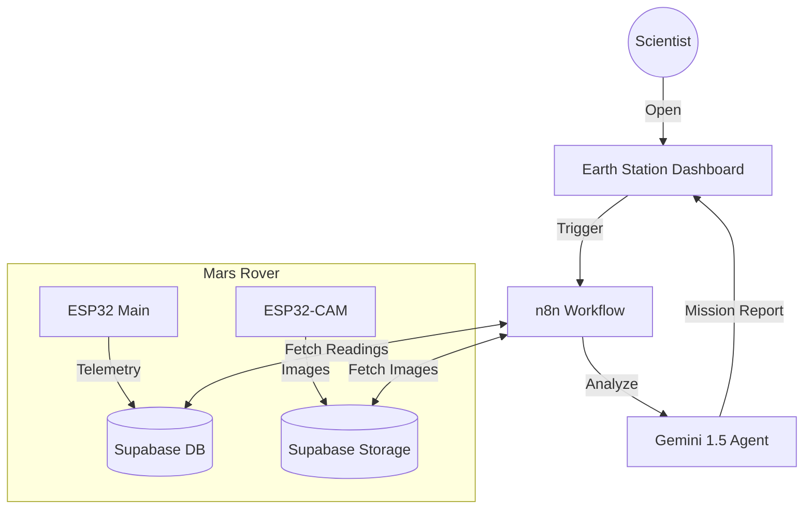

# 🚀 Earth Station: Mars Rover Mission Control


**Chief Scientist: Hammad**

A sophisticated, fully integrated Mars Rover exploration platform. This system autonomously navigates terrain, captures high-resolution visual measurements, and utilizes a generative AI agent to synthesize real-time scientific status reports. The mission is monitored via a premium "Earth Station" web dashboard.

---

## 🏗 System Architecture



## 🛠 Features

### 🤖 Planetary Rover (`rover1/`)
*   **Dual-Core Processing**: Powered by ESP32 for simultaneous navigation and telemetry.
*   **Autonomous Navigation**: Avoiding obstacles using Ultrasonic (HC-SR04) and IR sensors.
*   **Environmental Sensing**: Real-time monitoring of Temperature, Humidity, Pressure, and Altitude (BMP280 + DHT11).
*   **Light Detection**: LDR sensor establishes Day/Night cycles.
*   **Dual-Mode Connectivity**:
    *   **AP Mode**: Creates local WiFi for low-latency manual control.
    *   **Station Mode**: Uplinks data to Earth (Supabase Cloud).

### 👁 Visual Intelligence (`cam1/`)
*   **ESP32-CAM**: Dedicated vision module.
*   **Cloud Uplink**: Captures and uploads JPEGs directly to **Supabase Storage**.

### 🧠 Artificial Intelligence (`workflows/`)
*   **n8n Workflow**: An advanced automation pipeline.
*   **Generative AI**: Uses **Google Gemini 1.5 Flash**.
*   **Sensor Fusion**: Correlates visual data (darkness) with sensor readings (LDR "Night") to verify environmental consistency.
*   **Safety Analysis**: Determines habitability for human life.

### 💻 Earth Station Dashboard (`dashboard/`)
*   **Sci-Fi Interface**: A "Dark Mode" responsive web app.
*   **One-Click Reports**: Triggers the AI agent on demand.
*   **Live Rendering**: Displays Markdown-formatted scientific briefs instantly.

---

## 📂 Project Structure

```text
mars-rover/
├── dashboard/              # 🛰 Earth Station Interface
│   ├── index.html          # Main Control Panel
│   └── style.css           # Premium Sci-Fi Styling
├── workflows/              # 🧠 AI Logic
│   └── mars_rover_report.json  # The "Brain" (Import to n8n)
├── rover1/                 # 🤖 Main Rover Firmware
│   └── rover1.ino          # Motor & Sensor Logic
└── cam1/                   # 👁 Camera Firmware
    └── cam1.ino            # Image Capture & Upload
```

---

## 🚀 Quick Start Guide

### 1. Database Setup (Supabase)
1.  Create a project at [Supabase.com](https://supabase.com).
2.  **Database**: Create tables `sensor_readings` and `camera_captures`.
3.  **Storage**: Create a public bucket `rover_images`.

### 2. Firmware Deployment
*   **Main Rover**: Open `rover1/rover1.ino` in Arduino IDE. Update `ssid`, `password`, `supabaseUrl`, and `supabaseKey`. Upload to ESP32.
*   **Camera**: Open `cam1/cam1.ino`. Update credentials. Upload to ESP32-CAM.

### 3. Intelligence Activation (n8n)
1.  Install n8n (Desktop or Cloud).
2.  Import `workflows/mars_rover_report.json`.
3.  Configure your Supabase and Google Gemini credentials.
4.  **Activate** the workflow.
5.  Copy the **Production Webhook URL**.

### 4. Launch Mission
1.  Open `dashboard/index.html` in VS Code.
2.  Paste your Webhook URL into the configuration section.
3.  Open `index.html` in your browser.
4.  Click **"GENERATE MISSION REPORT"**.

---

## 🔧 Technology Stack

*   **Hardware**: ESP32, ESP32-CAM, L298N Driver, Li-Ion Batteries.
*   **Firmware**: C++ (Arduino Framework).
*   **Backend**: Supabase (PostgreSQL + Object Storage).
*   **AI/Logic**: n8n, LangChain, Google Gemini.
*   **Frontend**: HTML5, CSS3, Vanilla JS.

---

## 📜 License
Distribute under MIT License. Open Source.