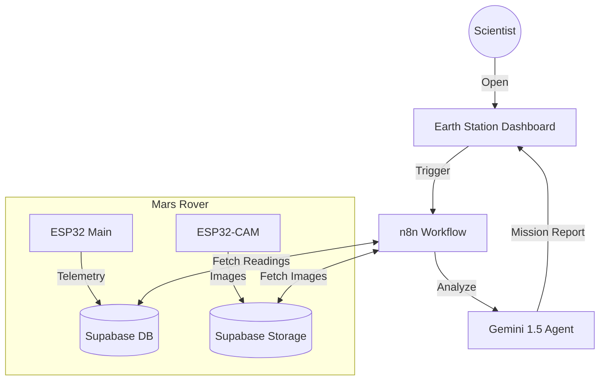

# 🚀 Earth Station: Mars Rover Mission Control


**Chief Scientist: Hammad**

A sophisticated, fully integrated Mars Rover exploration platform. This system autonomously navigates terrain with multi-sensor fusion, captures high-resolution visual measurements, and utilizes a multimodal AI agent to synthesize real-time scientific status reports. The mission is monitored via a premium "Earth Station" web dashboard.

---

## 🏗 System Architecture



## 🛠 Features

### 🤖 Planetary Rover (`rover1/`)
*   **Dual-Core Processing**: Powered by ESP32 for simultaneous navigation and telemetry.
*   **Autonomous Navigation**: Streamlined obstacle avoidance using Ultrasonic (HC-SR04) logic. (IR sensors removed for efficiency).
*   **Precision Telemetry (MPU6050)**: Real-time **Pitch**, **Roll**, and **Vibration** (Terrain) monitoring using direct I2C registers.
*   **Environmental Sensing**: Monitoring of Temperature, Humidity, Pressure, and Altitude (BMP280 + DHT11).
*   **Guardian Mission Log**: Automated recording of `last_event` statuses (e.g., "Obstacle Avoided", "Tilt Warning", "Impact Detected").
*   **Dual-Mode Connectivity**:
    *   **AP Mode**: Creates local WiFi for low-latency manual control.
    *   **Station Mode**: Uplinks data to Earth (Supabase Cloud).

### 👁 Visual Intelligence (`cam1/`)
*   **ESP32-CAM**: Dedicated vision module.
*   **Cloud Uplink**: Captures and uploads JPEGs directly to **Supabase Storage**.
*   **Multimodal Fusion**: Images are now visually analyzed by the AI agent to describe terrain objects (furniture, rocks, etc.).

### 🧠 Artificial Intelligence (`workflows/`)
*   **n8n Workflow**: An advanced automation pipeline with multimodal vision support.
*   **Generative AI**: Uses **Google Gemini 1.5 Flash**.
*   **Stability Analysis**: Interprets IMU data to determine slope safety and terrain roughness.
*   **Mission Health Scoring**: Automatically calculates a health percentage based on physical events and environmental safety.

### 💻 Earth Station Dashboard (`dashboard/`)
*   **Sci-Fi Interface**: A "Dark Mode" responsive web app.
*   **Horizon Indicator**: New "Orientation & Stability" card showing live tilt and terrain status.
*   **One-Click Reports**: Triggers the Chief Scientist AI agent on demand.

---

## 📂 Project Structure

```text
mars-rover/
├── dashboard/              # 🛰 Earth Station Interface
├── workflows/              # 🧠 n8n AI Logic
├── rover1/                 # 🤖 Main Rover Firmware (ESP32)
└── cam1/                   # 👁 Camera Firmware (ESP32-CAM)
```

---

## 🚀 Quick Start Guide

### 1. Database Setup (Supabase)
1.  **Database**: Create tables `sensor_readings` and `camera_captures`.
2.  **Schema Expansion**: Add `pitch`, `roll`, `vibration`, and `last_event` columns to `sensor_readings`.
3.  **Storage**: Create a public bucket `rover_images`.

### 2. Firmware Deployment
*   **Main Rover**: Open `rover1/rover1.ino`. Update `wifiSSID`, `wifiPass`, and Supabase credentials. Upload (SDA: 25, SCL: 26).
*   **Camera**: Open `cam1/cam1.ino`. Update credentials. Upload Image size: VGA.

### 3. Intelligence Activation (n8n)
1.  Import `workflows/mars_rover_report.json` into n8n.
2.  Configure Supabase and Google Gemini credentials.
3.  Ensure the agent has multimodal access to the image binary data.

---

## 🔧 Technology Stack

*   **Hardware**: ESP32, ESP32-CAM, MPU6050 IMU, BMP280, DHT11, HC-SR04 Ultrasonic.
*   **Firmware**: C++ (Arduino Framework).
*   **Backend**: Supabase (PostgreSQL + Storage).
*   **AI/Logic**: n8n, LangChain, Google Gemini 1.5 Flash.

---

## 📜 License
Distribute under MIT License. Open Source.