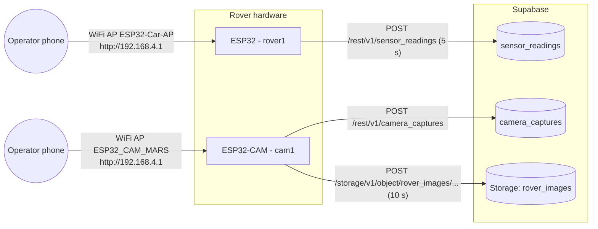

# Architecture

## Overview

Two independent ESP32 boards. They share a Supabase backend but never talk to each other directly.

Both boards run in `WIFI_AP_STA` mode:

* **STA (station)** joins a WiFi network with internet access and uploads to Supabase.
* **AP (access point)** hosts a local network so an operator can reach the board's web page without internet.

If the STA connection fails at boot, the board keeps running in AP-only mode and skips uploads.

## Components

### `rover1/` — main rover (ESP32 DevKit)

| Concern | Implementation |
|---|---|
| Drive | Two DC motors on an H-bridge, PWM through `ledcAttach` / `ledcWrite` (ESP32 core 3.x API) |
| Obstacle avoidance | HC-SR04, median of 3 readings. Under 40 cm: stop, reverse 430 ms, turn right 600 ms |
| IMU | MPU6050 via `MPU6050_tockn`. Gyro offsets are calibrated at boot, so **keep the rover still while it powers on** |
| Environment | DHT11 (temperature, humidity), BMP280 (pressure, altitude relative to the boot baseline), LDR (day/night) |
| Event log | `lastEvent` is one of `Nominal`, `Obstacle Avoided`, `Tilt Warning`, `Impact Detected`. It resets to `Nominal` after each upload |
| Local UI | `WebServer` on port 80: `/` (page), `/startnav`, `/startstop`, `/sensors/data` (JSON) |
| Upload | `sensor_readings` insert every 5 s, timed with `millis()` so nothing blocks |

Control loop: a single `loop()` with no RTOS tasks. The autonomous avoidance sequence uses `delay()`, so the web server and uploads pause for about 1.2 s during each avoidance manoeuvre.

### `cam1/` — camera (AI Thinker ESP32-CAM)

| Concern | Implementation |
|---|---|
| Capture | VGA JPEG with PSRAM. Falls back to CIF with a single DRAM frame buffer when PSRAM is missing |
| Local UI | `esp_http_server`: `/` (page), `/capture` (one JPEG). The page polls every 3 s |
| Upload | An `esp_timer` sets a flag every 10 s. `loop()` then captures, uploads to Storage, and inserts the public URL into `camera_captures` |
| Flash LED | GPIO 4 lights up while a frame is captured |

## Data model (Supabase)

| Table | Columns written by firmware |
|---|---|
| `sensor_readings` | `temperature`, `humidity`, `ldr_state` (`"Day"`/`"Night"`), `pressure` (hPa), `altitude` (cm, relative), `pitch`, `roll`, `vibration`, `last_event` |
| `camera_captures` | `image_url` |

Storage bucket `rover_images` is public. Files are named `capture_<millis>_<counter>.jpg`.

The recommended schema and row-level security policies are in [`supabase/schema.sql`](supabase/schema.sql).

## Pin map

### Rover (ESP32)

| Function | GPIO |
|---|---|
| Motor A: ENA / IN1 / IN2 | 23 / 22 / 21 |
| Motor B: ENB / IN3 / IN4 | 19 / 18 / 5 |
| Ultrasonic TRIG / ECHO | 32 / 35 |
| DHT11 | 27 |
| LDR digital out / LED | 33 / 4 |
| I2C SDA / SCL (MPU6050, BMP280 @0x76 or 0x77) | 25 / 26 |

### Camera (AI Thinker ESP32-CAM)

These are the standard AI Thinker camera pins (see `cam1.ino`). The flash LED is on GPIO 4.

## Security model

The threat model assumes a **public repository** and a rover operated over open WiFi in shared spaces.

| Asset | Exposure | Mitigation |
|---|---|---|
| WiFi / AP passwords, Supabase key | Previously hard-coded | Now in git-ignored `secrets.h`. CI runs gitleaks on every push and PR |
| Supabase anon key | Compiled into firmware. Anyone with a board's flash dump can extract it | Treat it as public. All protection must come from **RLS policies**: insert-only for `anon`, no update or delete (see `schema.sql`) |
| Supabase `service_role` key | — | **Never** put it on a device or in the repo |
| AP control page | Anyone who joins the AP can drive the rover | WPA2 AP password (8+ characters, not the example value). No HTTP auth yet (see Known gaps) |
| Camera feed | Anyone who joins the camera AP can view it. Uploaded images are public URLs | Public bucket by design. Do not point the camera at private spaces |

### Known gaps (tracked for future work)

* **No TLS certificate validation.** `cam1` calls `setInsecure()`, and `rover1` uses `HTTPClient` without a CA. Traffic is encrypted but not authenticated, so a MITM on the STA network is possible. Fix: pin the Supabase root CA.
* **No auth on the local HTTP endpoints.** `/startnav` and `/startstop` are plain GETs. Fix: add a token or basic auth, and use POST for commands.
* **`x-upsert: true` on uploads** requires an UPDATE policy on storage objects. Filenames are already unique, so upsert can be dropped and the UPDATE policy removed.
* **Impact detection never fires.** `lastAccX` is updated before the comparison in `loop()`.
* **The control page shows `--` for a reading of exactly 0**, because of truthiness checks in the page JS.
