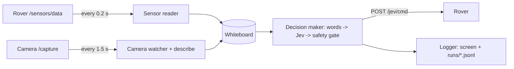

# Earth Station

A Python program on a laptop that lets **Jev** drive the rover. About twice a second it reads the rover's sensors, looks at the latest camera description, asks Jev for the next move, checks it against the safety rules, and sends it to the rover.

Both AP control pages keep working the whole time. Any button pressed on the phone takes the rover out of Jev Auto, and the Earth Station goes quiet.

The design pages in [`docs/design/`](design/) explain the idea with diagrams. Open them in a browser.

---

## Set up on any laptop

You need **Python 3.11+** and **git**. Nothing else: no rover, Jev account or internet is needed to try it.

```sh
git clone https://github.com/Hammad-Sheikhh/mars-rover.git
cd mars-rover
```

| Windows (PowerShell) | macOS / Linux |
|---|---|
| `powershell -ExecutionPolicy Bypass -File scripts\setup.ps1` | `sh scripts/setup.sh` |
| `.\.venv\Scripts\Activate.ps1` | `. .venv/bin/activate` |

The setup script:
1. finds Python 3.11+
2. creates a private environment in `.venv/`
3. installs the Earth Station and its test tools
4. creates `.env` from `.env.example`, unless you already have one

Run the setup again any time to pick up new dependencies.

## Try it with the simulator

```sh
python -m earth_station --sim
```

This starts a fake rover and a fake camera inside the program and lets the mock Jev drive. You should see something like:

```
Earth Station pre-flight
  OK  rover http://127.0.0.1:52811 | camera http://127.0.0.1:52812
  OK  Jev mock | describe mock
  OK  rover answering | mode jev | distance 150 cm
  OK  camera answering | 0.1 KB | "Open floor ahead, nothing close."
  OK  Jev answering | 0 ms
  OK  logging to runs/2026-10-04_232152.jsonl
rover already in Jev Auto
23:21:52.786 #1     forward     0.92  -> sent, rover ok
23:21:55.827 scene  "Cardboard box about 74 cm ahead. Open floor to the right."
23:21:56.312 #7     turn_right  0.91  -> sent, rover ok
```

Press `Ctrl+C` to stop. It sends a final `stop` to the rover and prints a summary.

To act as "the phone" while it runs, start the simulator on its own:

```sh
python -m earth_station.sim                    # terminal 1: fake rover :8081, camera :8082
python -m earth_station                        # terminal 2: uses the defaults in .env
curl "http://127.0.0.1:8081/mode?set=manual"   # terminal 3: press a phone button
curl "http://127.0.0.1:8081/mode?set=jev"      #             press Jev Auto again
```

## Connect the real Jev

This works with the simulator, so you can do it before you have the rover.

1. Get a key: sign in at [console.typesafe.ai/keys](https://console.typesafe.ai/keys) and create an API key. Copy it.
2. Open `.env` in the repo folder and set:
   ```sh
   JEV_MODE=live
   JEV_API_KEY=<paste your key here>
   ```
   Save the file. `.env` never goes to GitHub, so the key stays private. Never paste it into code, issues or chat.
3. Test it with the fake rover (internet needed, no rover):
   ```sh
   python -m earth_station --sim
   ```
   The pre-flight should show `OK  Jev live` and `OK  Jev answering | <time> ms`. Each decision line is now the real Jev's choice.
4. If it fails, the pre-flight line says why: `rejected the API key` means the key is wrong, and `rate-limited` means wait a moment and try again. To go back to the offline stand-in, set `JEV_MODE=mock`.

The request and reply follow TypeSafe's [API reference](https://docs.typesafe.ai/api). The tests in `tests/test_jev_client.py` check our code against its examples.

## Run it with the real rover

1. Put the rover, the camera and the laptop on **the same phone hotspot**. Type its name and password once in `.env` (`WIFI_SSID`, `WIFI_PASS`, plus `ROVER_AP_PASS` and `CAM_AP_PASS`), then run `python -m earth_station.secrets`. It writes both boards' `secrets.h` from `.env` and makes the shared `ROVER_CMD_TOKEN`.
2. Flash `rover1` firmware 2.1 or newer (it has Jev Auto) and the camera.
3. Leave `ROVER_URL` empty: the Earth Station **finds the boards itself** (see [Finding the boards](#finding-the-boards)). Until the camera firmware gets its name (milestone 4), set `CAMERA_URL` to the IP address the camera prints on its Serial monitor at boot.
   Then run `python -m earth_station --check`: every line should say OK.
4. Start in **suggest-only** mode first. It decides and logs, but never moves the rover:
   ```sh
   python -m earth_station --suggest
   ```
5. Press **Jev Auto** on the rover's AP page and watch what Jev would do while you drive by hand.
6. When you trust it, run `python -m earth_station` and let it drive, slowly and in an open space.

To test the link without any AI (build step 1), send single moves by hand:

```sh
python -m earth_station.drive forward
python -m earth_station.drive turn_left --ms 300 --speed 150
python -m earth_station.drive stop
```

## Finding the boards

Nobody types an IP address. Before it starts, the Earth Station (and `--check` and `earth_station.drive`) looks for each board in this order, and the first hit wins:

1. **The address in `.env`** (`ROVER_URL` / `CAMERA_URL`), if you set one.
2. **The simulator on this laptop** (`python -m earth_station.sim`, ports 8081 and 8082).
3. **Its name**, `rover.local` / `cam.local`. The Earth Station sends its own mDNS question ("who is rover.local?") and the board answers with its address, so this works the same on Windows, macOS and Linux. If nobody answers, it asks the operating system as well.
4. **A network scan**: it asks every address on the laptop's network (a /24, about 254 addresses, 64 at a time) for `GET /id`.

A board only counts if its `/id` says which board it is, so the scan can't mistake the camera, or a printer, for the rover. Finding takes a few seconds when the name works, and about 10 seconds when nothing is found. When it fails, the message lists every place it looked. Some phone hotspots keep devices from seeing each other: then neither the name nor the scan can work, and you can put the address from the Serial monitor in `.env`, or use a different phone (see [SPEC.md](../SPEC.md), open questions).

The code is in `earth_station/finder.py` and `earth_station/mdns.py`, and `tests/test_finder.py` proves each step against the simulator.

## Settings (`.env`)

Every setting has a working default for the simulator. See `.env.example` for the full list.

| Setting | Default | Meaning |
|---|---|---|
| `ROVER_URL` / `CAMERA_URL` | empty | Board addresses. Empty means "find it"; set one only if the finder can't |
| `ROVER_CMD_TOKEN` | `sim-token` | Shared secret for `/jev/cmd`. Must match the rover's `secrets.h` |
| `JEV_MODE` | `mock` | `mock` = offline stand-in, `live` = real Jev API (needs `JEV_API_KEY`) |
| `JEV_API_KEY` | empty | Your key from [console.typesafe.ai/keys](https://console.typesafe.ai/keys) |
| `JEV_API_URL` / `JEV_MODEL` | `https://api.typesafe.ai/v1/systemone` / `jev-latest` | Usually leave as they are |
| `DESCRIBE_MODE` | `mock` | `mock` or `live` (the teammate's vision model, needs `VISION_API_KEY`) |
| `DECIDE_EVERY_MS` | `500` | How often Jev is asked |
| `MIN_CONFIDENCE` | `0.60` | Below this, the gate sends `stop` |
| `MAX_SPEED` / `MOVE_MS` | `170` / `300` | Speed cap (0–255) and length of each move |
| `GOAL` | `explore the room safely` | Put into every message Jev reads |

Keys live only in `.env`, which is git-ignored. Never put them in code.

## How it works



| File | Job |
|---|---|
| `earth_station/__main__.py` | Command line, pre-flight, clean shutdown |
| `earth_station/station.py` | The workers and the decision cycle |
| `earth_station/whiteboard.py` | Shared notebook, with a timestamp on every value |
| `earth_station/links.py` | HTTP to the rover and camera |
| `earth_station/describe.py` | **Teammate:** photo → short description |
| `earth_station/state_text.py` | Numbers → plain words for Jev |
| `earth_station/jev_client.py` | Jev API client, plus the mock policy |
| `earth_station/safety_gate.py` | The six laptop-side safety rules |
| `earth_station/logger.py` | Console output and the JSONL run log |
| `earth_station/sim.py` | Fake rover and camera |
| `earth_station/drive.py` | Send one move by hand |

### Safety gate rules

1. Only drive when the rover reports `mode: "jev"`. Otherwise send nothing.
2. Telemetry older than 0.5 s, or a scene older than 3 s, means `stop`.
3. Jev under `MIN_CONFIDENCE` means `stop`.
4. Jev chooses `forward` but itself says the path is blocked: `stop`.
5. Speed is capped at `MAX_SPEED`, and each move lasts `MOVE_MS` (max 500).
6. Any error (Jev, camera or rover) means `stop`.

The rover has its own second layer: the obstacle and tilt vetoes, and the watchdog.

### Run logs

Each run writes `runs/<date>_<time>.jsonl`, one JSON object per line: every decision with the exact text Jev read, its answer, the gate's verdict and the rover's reply. `runs/` is git-ignored.

## Rover protocol

This is the contract between the Earth Station and the rover. `rover1/rover1.ino` (firmware 2.1) and the simulator (`earth_station/sim.py`) both follow it. Change all three together.

**`GET /id`**: `{"board": "rover", "firmware": "2.1.0"}` (the camera will answer `"camera"`). Used to recognise the boards on the network.

**`GET /startjev`**: the **Jev Auto** button on the rover's control page. It switches Jev Auto on or off.

**`GET /sensors/data`**: the existing reply, plus these fields:

```json
{ "distance_cm": 62, "mode": "jev", "pitch": 3.1, "roll": -1.2, "vibration": 0.04,
  "last_event": "Nominal", "temperature": 29.4, "humidity": 41, "...": "..." }
```

* `distance_cm`: latest ultrasonic median, or `-1` if there's no echo.
* `mode`: `"manual"`, `"autonomy"` or `"jev"`. If the field is missing, the Earth Station treats the rover as manual and never drives it.
* `last_event`: `Nominal`, `Obstacle Avoided`, `Tilt Warning` or `Impact Detected`.

**`POST /jev/cmd`**: header `X-Token: <ROVER_CMD_TOKEN>`, body:

```json
{ "seq": 4182, "action": "turn_right", "speed": 170, "duration_ms": 300 }
```

| Reply | When |
|---|---|
| `200 {"ok": true, "seq": 4182, "executed": "turn_right"}` | Move started |
| `200 {"ok": false, "seq": 4182, "refused": "not_in_jev_mode"}` | Rover isn't in Jev Auto |
| `200 {"ok": false, "seq": 4182, "refused": "obstacle_too_close"}` | Forward requested under 20 cm |
| `200 {"ok": false, "seq": 4182, "refused": "tilt"}` | Pitch or roll over 35° |
| `200 {"ok": false, "seq": 4182, "refused": "unknown_action"}` | `action` isn't one of the five |
| `200 {"ok": true, "seq": 4182, "executed": "duplicate_ignored"}` | Same `seq` as the last command (a retry) |
| `400 {"ok": false, "refused": "bad_json"}` | Empty body |
| `401 {"ok": false, "refused": "bad_token"}` | Wrong or missing token |

Rover rules:
* `action` must be one of `forward`, `turn_left`, `turn_right`, `reverse`, `stop`. Clamp `speed` to 0–255 and `duration_ms` to 0–500.
* Ignore a command whose `seq` equals the last one (a retry). Forget the last `seq` when Jev Auto is switched on.
* **Watchdog:** in Jev Auto, if no command has arrived for 1.5 s, stop the motors.
* Run moves without `delay()`. Track the end time with `millis()` so the web server stays responsive.
* Any manual button press (`/startnav`, `/startstop`) leaves Jev Auto.
* While a move runs, the rover keeps checking: it stops early if something comes closer than 20 cm during `forward`, or if it tilts past 35°.

## Tests

```sh
pytest           # 33 tests: safety rules, wording, parsing, full loop on the simulator
ruff check .     # lint
```

CI runs both on every pull request.

## Not done yet

* **Rover firmware on hardware.** The code is written and compiles in CI, but it hasn't been tested on the real rover yet.
* **Camera** `cam.local` and `/id` ([SPEC.md](../SPEC.md) milestone 4).
* **`describe.py` live mode** (project leader, [SPEC.md](../SPEC.md) milestone 5). Implement `_describe_live`, then test it with `python -m earth_station.describe photo.jpg`.
